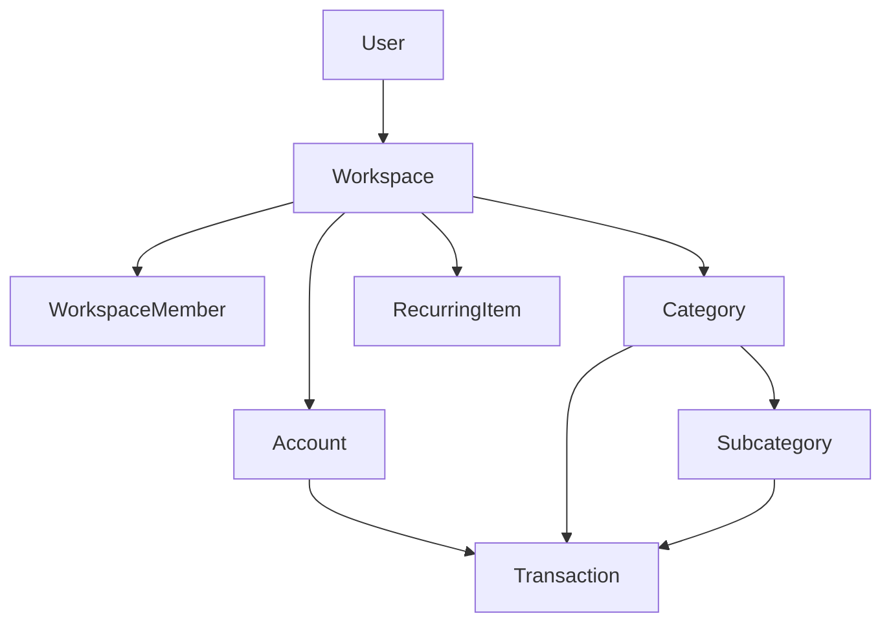

# HexaTrack Architecture

## System

```text
Next.js 15 PWA -> ASP.NET Core API -> PostgreSQL
                     |-> Redis
                     |-> Hangfire
                     |-> External providers
```

## Backend Standard

- ASP.NET Core controllers.
- Application services for business rules.
- EF Core for persistence and migrations.
- Repositories/Unit of Work where established by codebase.
- FluentValidation for DTO validation.

## Frontend Standard

- App Router.
- Zustand state ownership.
- API client layer.
- Reusable components.
- Token-only Tailwind usage.

## Workspace Flow



## Canonical Docs

Start at [READ_FIRST.md](READ_FIRST.md). Root `docs/` and `features/` are canonical.
